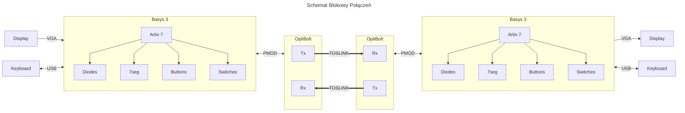
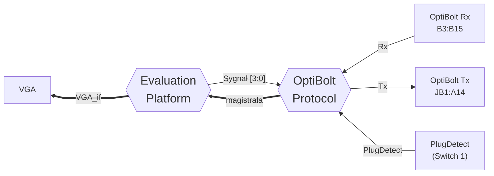
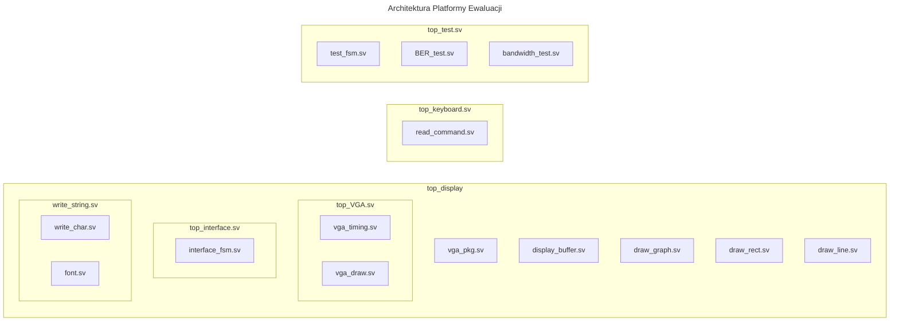

# OptiBolt - Protocol and Evaluation

**Autorzy:** *Tomasz Więcławski (@TomaszWieclawski), Sebastian Zoń (@Ziemniaczenka)*

## Opis projektu

  Prototyp hybrydowgo protokołu komunikacji OptiBolt i platforma ewaluacyjna.

  Protokół fizycznie składa się z części elektrycznej (emulowanej) oraz światłowodowej (zrealizowanej na transcieverach TOSLINK).

  Platforma ewaluacyjna obsługuje podłącznie klawiatury i interfejsu VGA, służy do przeprowadzania testów interfejsu i wyświetlania rezultatów.

## TODO

<b><big> Lista Zadań </big></b>

*   

    
<b>Harmonogram </b>

    | Date | Week | Task | Who | Status |
    |:---:  | :---: | :---                                                | :---:             | :---:   |
    | 13.04 | 1 | Inicjalizacja projektu, dobór elementów                 | Wszyscy           | 🟢 Done |
    | 20.04 | 2 | Funkcja drawstring                                      | @Ziemniaczenka    | 🟢 Done |
    | 27.04 | 3 | Schematy w readme                                       | @Ziemniaczenka    | 🟢 Done |
    | 27.04 | 3 | Zarys protokołu                                         | @TomaszWieclawski | 🟢 Done |
    | 4.05  | 4 | PRZERWA (Egzamin 0 UEA2)                                | @Ziemniaczenka    | 🟢 Done |
    | 11.05 | 5 | Pozostałe funkcje draw, top_draw                        | @Ziemniaczenka    | 🟡 WiP  |
    | 11.05 | 5 | Ustalenie parametrów i sygnałów sterujących protokołu   | @TomaszWieclawski | 🟡 WiP  |
    | 18.05 | 6 | Klawiatura, wiersz poleceń                              | @Ziemniaczenka    | 🟡 WiP  |
    | 18.05 | 6 | Przerobienie modułu UART na OptiBolt                    | @TomaszWieclawski | 🟡 WiP  |
    | 25.05 | 7 | Złożenie hardware, generacja bitstreamu, pierwsze testy | Wszyscy           | 🟡 WiP  |
    | 01.06 | 8 | Integracja protokołu z ewaluacją                        | Wszyscy           | 🔴 TODO |
    | 08.06 | 9 | Testy końcowe i finalizacja dokumentacji                | Wszyscy           | 🔴 TODO |
    | 15.06 | 10| 16.06 PIERWSZY TERMIN ODDANIA PROJEKTU                  | Wszyscy           | 🔴 TODO |
    

    

    
<b>Lista pytań </b>

    - Czy możemy korzystać z innych modułów?
      - VHDL od myszki np.
      - Verilog od UART
      - SystemVerilog z internetu
      - TAK
    - Jaki reset ma być?
      - Asynchroniczny zanegowany (rst_n)
    - Czy wyjścia z modułów mają być rejestrowalne?
      - Powinny być chyba że jest konkretny powód by nie były
    - Czy vivado sprawdza timing violation by default 
      - Tak
    - Czy dokumentacja końcowa może być w Markdown zamiast DOCX?
      - może być ale wyeksportowany do PDFa

    

*   

    
<b>Dokumentacja i konfiguracja </b>

    - [x] Ustalić nazwę projektu
    - [x] Krótki opis
    - [ ] Git
      - [x] Stworzyć Repo
      - [ ] Dowiedzieć się jak działają pull request i review
    - [x] Napisać README
    - [x] Dodać referencyjne dokumenty (np. zielony pdf z konwencjami)
    - [ ] VSCode settings + formatter config
    - [ ] Nauczyć się Markdown i Mermaid

    

*   

    
<b>Hardware</b>

    - [x] Znaleźć złącze
    - [x] Narysować schemat
    - [x] Zamówić brakujące części
    - [x] Zlutować
    

*   

    
<b>SystemVerilog </b>

    - [ ] Podział na moduły, diagram
    - [ ] Testbenche do grup modułów
    - [x] Sprawdzić czy Vivado robi timing analisys by default
    - [ ] Ustalenie Clock domains
      - [ ] CDC pomiędzy sekcjami
    

*   

    
<b>Protokół</b>

    - [x] Założenia, teoria
    - [ ] Manchester encoder/decoder
    - [ ] Ustalić zakres BAUDRATE i Oversampling, min and max speed
      - [ ] tabela dopuszczalnych (lookup table)
      - [ ] enumy do maszyn stanów (IDLE, PREAMBLE, ERROR itp.)
    - [ ] Warstwy modelu
    - [ ] Rejestry konfiguracyjne do protokołu
      - [ ] np. Baudrate
      - [ ] sygnały sterujące (np. zmień baudrate)
        - [ ] odpowiedź zwrotna (wait, success, error)
    - [ ] Flowchart, Sequence diagrams
    

*   

    
<b>Program testowy</b>

    - [ ] Wyświetlanie VGA
      - [x] VGA Parameters include 
      - [ ] Ustalenie layoutu ekranu
      - [x] DrawBitmap
      - [x] DrawRect
      - [x] DrawString
        - [ ] Improve code
        - [ ] Make output registerable (add one cycle delay)
        - [ ] Add more fonts
      - [ ] DrawChart
    - [ ] Obsługa klawiatury
    - [ ] Różne testy (max baudrate, BER, latency, wysyłanie wiadomości, itd.)
    

## Narzędzia i materiały dodatkowe

<b><big> Lista Narzędzi </big></b>

*   

    
<big>VSCode </big>

    
    * **Rozszerzenia**
      * SystemVerilog
        * Verilog-HDL/SystemVerilog/Bluespec SystemVerilog by Masahiro Hiramori
          * Verible
        * DVT IDE for Verilog/SystemVerilog/VHDL/e Language by AMIQ EDA s.r.l.
          * Dostępne tylko w pracowni!
      * Dokumentacja
        * Markdown
          * Markdown All in One
          * Markdown Preview Mermaid Support
        * vscode-pdf
        * TIFF Preview
        * Docx/ODT Viewer
        
      * Git
        * GitHub Pull Requests

    

*   

    
<big>Materiały dodatkowe </big>

    
    * **Zasady kodowania**
      * [wikiMTM](https://wiki.mtm.agh.edu.pl/pl/students/courses/uec/sv-rtl-coding-rules)
      * [PDF](doc/mtm-digital-guidelines.pdf)
  
    * **SystemVerilog**
      * [ChipVerify Tutorial](https://www.chipverify.com/systemverilog/systemverilog-tutorial)
      * CDC (Clock Domain Crossing)
        * [CV CDC](https://www.chipverify.com/rtl-synthesis/clock-domain-crossing)
        * [MTM wiki](https://wiki.mtm.agh.edu.pl/pl/students/courses/uec/cdc)
      * OOP (not relevant)
        * [CV Classes](https://www.chipverify.com/systemverilog/systemverilog-class)
      * UVM (not relevant)
        * 

          
<a href="https://www.chipverify.com/uvm/uvm-tutorial">CV OVM Tutorial</a>

          * >**Common Beginner Mistakes:**\
            Mistake #1: Trying to Learn UVM Without SystemVerilog OOP\
            Mistake #2: Reading the UVM Reference Manual First\
            Mistake #3: Trying to Understand All of UVM at Once\
            Mistake #4: Not Running Code While Learning
          * > **UVM Learning Curve in Industry**\
            Professional verification teams typically train new engineers with this timeline:  
            **Week 1-2:** SystemVerilog OOP refresher and basic UVM concepts.  
            **Week 3-4:** Build a simple UVM testbench from scratch (UART, I2C, SPI).  
            **Week 5-8:** Work on a real project under mentorship, extending existing environments.  
            **Month 3-6:** Independent contribution to verification IP development. Most engineers become proficient within 6 months of hands-on practice, even without prior UVM experience—if they have strong SystemVerilog foundations.
          
         
  
        * [Vivado docs](https://docs.amd.com/r/en-US/ug900-vivado-logic-simulation/Vivado-Simulator-Compilation-Options)  
    * **Basys 3**
      * [Reference manual](https://digilent.com/reference/programmable-logic/basys-3/reference-manual)
    * **Informacje na temat protokołu**
      * [Hardware 1](https://vksdr.com/pmod/)   
      * [Hardware 2](https://tomverbeure.github.io/2021/01/18/SPDIF-Output-PMOD.html)   
      * [Toslink info](https://w2.electrodragon.com/Network-dat/fiber-optic-dat/TOSLINK-dat/TOSLINK-dat.md)
    * **Git**
      * [Poradnik gita](https://git-scm.com/book/pl/v2)
    * **Markdown**
      * GitHub Flavored Markdown
        * [Tutorial](https://docs.github.com/en/get-started/writing-on-github)
      * Mermaid
        * [Online editor](https://mermaid.ai/live/)
        * [Docs](https://mermaid.js.org/intro/)
    * **Grafiki**
      * [Lopaka - pixelart](https://lopaka.app/)

    

## Architektura Sprzętowa

<b><big>Schemat Blokowy Połączeń </big></b>

<b><big>Schemat Modułu OptiBolt PMOD </big></b>

<!-- Dwa pliki z odwróconym kolorem dla jasnego i ciemnego motywu -->

## Architektura Ogólna

<b><big>Schemat Połączeń Między Sekcjami (WiP) </big></b>

## Architektura Protokołu OptiBolt

## Architektura Platformy Ewaluacji

<b><big>Schemat Platformy Ewaluacji (WiP) </big></b>

<b><big>Opis Funkcjonalności Głównych bloków (WiP) </big></b>

  * Tests:
    * `top_test.sv`
      * description
    * `test_fsm.sv`
      * managing running multiple tests, solving conflicts
  * Keyboard:
    * `read_command.sv`
      * read arrow key inputs in interface
      * read input letters from keyboard to either run tests or send message to second board
  * Display:
    * `top_draw.sv`
      * Main VGA module with interface displayed 

