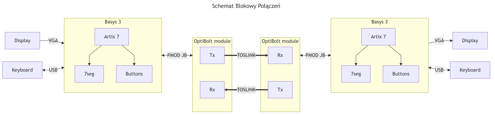
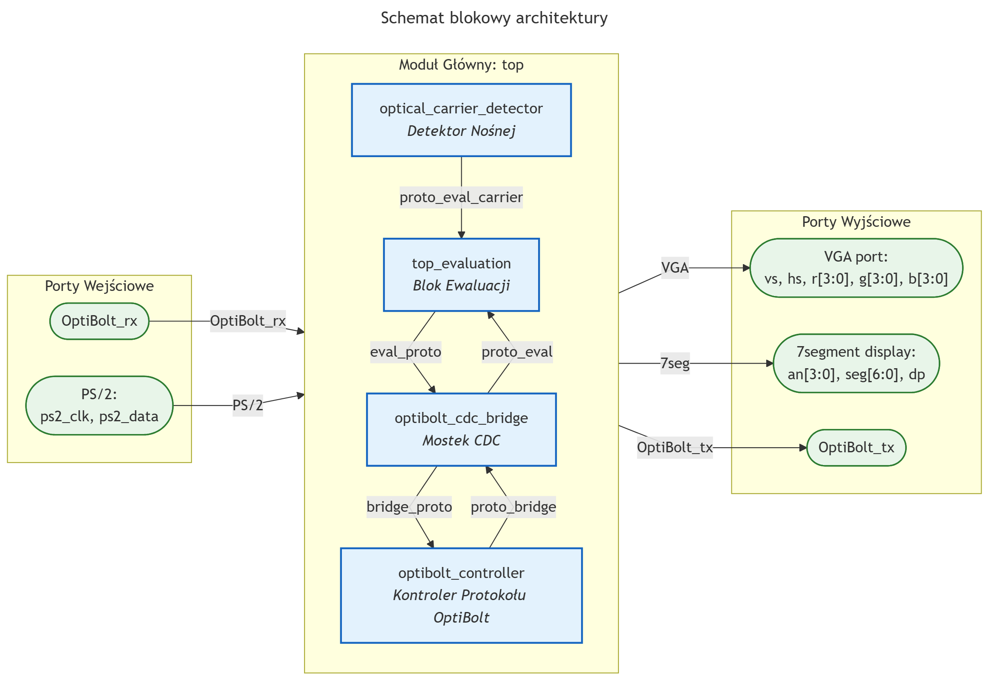
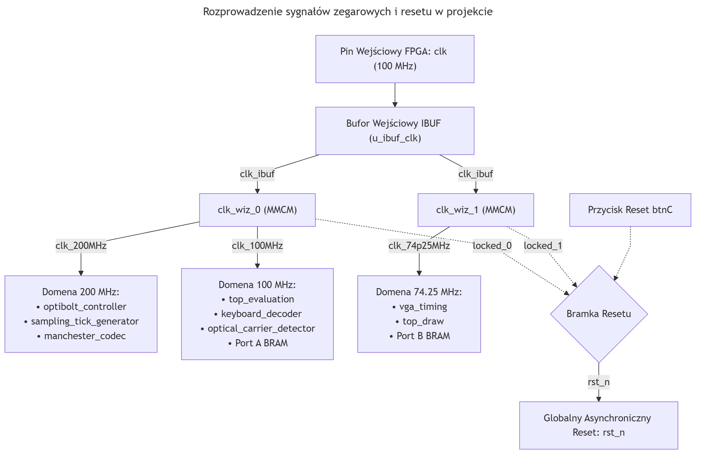
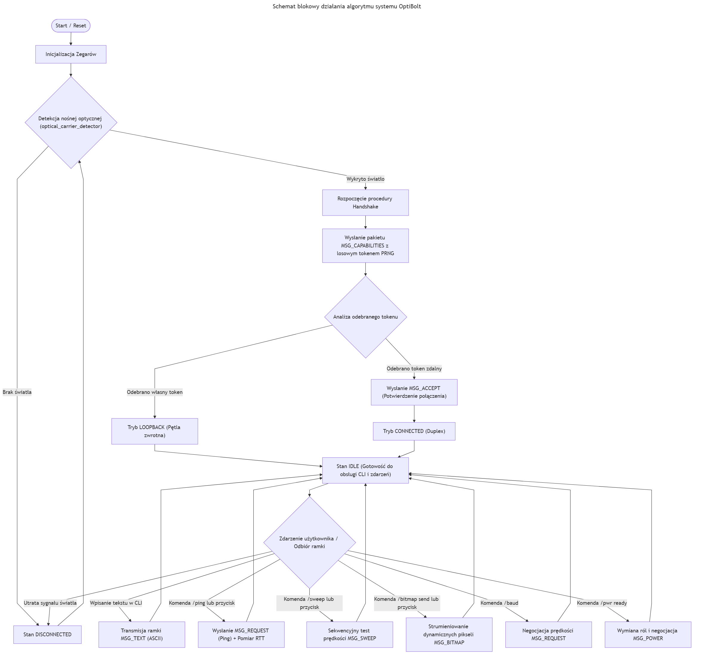

# ⚡ OptiBolt - Protocol and Evaluation Platform

<div align="center">


<br/>

[-0055FF?logo=xilinx)](https://www.xilinx.com/)
[](https://standards.ieee.org/)
[](https://www.xilinx.com/products/design-tools/vivado.html)
[](#8-weryfikacja-i-testy-symulacja-batch)
[](#9-zasoby-i-marginesy-czasowe)

</div>

> **Projekt zrealizowany w ramach przedmiotu Układy Elektroniki Cyfrowej 2 (MTM UEC2) na Wydziale EAIiIB AGH.**  
> **Autorzy:** Sebastian Zoń ([@Ziemniaczenka](https://github.com/Ziemniaczenka)), Tomasz Więcławski ([@TomaszWieclawski](https://github.com/TomaszWieclawski))  
> **Repozytorium:** [OptiBolt-protocol-and-evaluation](https://github.com/Ziemniaczenka/OptiBolt-protocol-and-evaluation)

---

## Spis Treści
- [⚡ OptiBolt - Protocol and Evaluation Platform](#-optibolt---protocol-and-evaluation-platform)
  - [Spis Treści](#spis-treści)
  - [1. Opis Projektu](#1-opis-projektu)
  - [2. Główne Funkcjonalności](#2-główne-funkcjonalności)
  - [3. Architektura Sprzętowa (Hardware Setup)](#3-architektura-sprzętowa-hardware-setup)
    - [Schemat Modułu OptiBolt PMOD (TOSLINK Transceiver):](#schemat-modułu-optibolt-pmod-toslink-transceiver)
  - [4. Architektura Systemu (Top-Level)](#4-architektura-systemu-top-level)
    - [Zestawienie Interfejsów Wewnętrznych:](#zestawienie-interfejsów-wewnętrznych)
  - [5. Dystrybucja Zegarów i Reset](#5-dystrybucja-zegarów-i-reset)
  - [6. Specyfikacja Protokołu OptiBolt](#6-specyfikacja-protokołu-optibolt)
    - [Struktura Ramki Danych:](#struktura-ramki-danych)
    - [Kody Nagłówków (Headers):](#kody-nagłówków-headers)
    - [Diagram Działania Algorytmu:](#diagram-działania-algorytmu)
  - [7. Platforma Ewaluacyjna (Interfejs VGA \& CLI)](#7-platforma-ewaluacyjna-interfejs-vga--cli)
    - [Lista Komend CLI:](#lista-komend-cli)
  - [8. Wyniki Pomiarów i Analiza Wydajności](#8-wyniki-pomiarów-i-analiza-wydajności)
    - [8.1. Zestawienie Prędkości: Mbps, MBaud i Przepustowość Danych](#81-zestawienie-prędkości-mbps-mbaud-i-przepustowość-danych)
    - [8.2. Pomiar Czasu Opóźnienia RTT (Ping)](#82-pomiar-czasu-opóźnienia-rtt-ping)
    - [8.3. Pomiar Czasu Transmisji Bitmapy 128x128](#83-pomiar-czasu-transmisji-bitmapy-128x128)
  - [9. Weryfikacja i Testy (Symulacja Batch)](#9-weryfikacja-i-testy-symulacja-batch)
    - [Uruchomienie Wszystkich Testów (Batch Simulation):](#uruchomienie-wszystkich-testów-batch-simulation)
    - [Podsumowanie Testów:](#podsumowanie-testów)
  - [10. Zasoby i Marginesy Czasowe](#10-zasoby-i-marginesy-czasowe)
    - [Wykorzystanie Zasobów Układu (Post-Implementation Utilization):](#wykorzystanie-zasobów-układu-post-implementation-utilization)
    - [Marginesy Czasowe (Timing Summary):](#marginesy-czasowe-timing-summary)
  - [11. Struktura Katalogów](#11-struktura-katalogów)
  - [12. Autorzy](#12-autorzy)

---

## 1. Opis Projektu

**OptiBolt** to prototyp **hybrydowego protokołu komunikacji optyczno-elektrycznej** wraz z **platformą ewaluacyjną** na układy FPGA Xilinx Artix-7 (Digilent Basys 3).


---

## 2. Główne Funkcjonalności

- 💡 **Transceiver optyczny TOSLINK z kodowaniem Manchester (200 MHz)**:
  - Prędkości transmisji: **100 kbps do 25 Mbps** z dynamicznym przełączaniem w locie.
  - Programowalne nadpróbkowanie: **8x oraz 16x** z filtracją szumów *majority voting*.
  - Ciągła zmiana stanów logicznych (DC-balance) niezbędna dla odbiorników światłowodowych ze sprzężeniem AC.
  - Automatyczna synchronizacja fazowa z 6-bitową preambułą i 2 bitami startu (`01010100`).
- 🔄 **Mostek CDC (Clock Domain Crossing)**:
  - Bezpieczne przekazywanie danych pomiędzy domenami 100 MHz i 200 MHz za pomocą asynchronicznych kolejek FIFO.
  - Rozciągacze impulsów błędów (*Pulse Stretchers*) gwarantujące 100% rejestracji zdarzeń 200 MHz w domenie 100 MHz.
- 🖥️ **Zaawansowana Platforma Ewaluacyjna (100 MHz & 74.25 MHz)**:
  - Dedykowana „karta graficzna” generująca sygnał **VGA 720p (1280x720@60Hz)** z dwuportową pamięcią BRAM.
  - Obsługa klawiatury USB przez PS/2 (dekoder scancode, wprowadzanie tekstu, obsługa strzałek i bufor historii 4 komend).
  - Wbudowany wiersz poleceń **CLI** z komendami diagnostycznymi i interaktywnym menu popup.
- ⚡ **Emulacja Kontraktów Zasilania (Power Delivery)**:
  - Negocjacja ról: **Wall (Source)**, **Battery (Dual-Role)**, **Sink (Device)**.
  - Wspierane profile napięciowe: **5V, 9V, 12V, 20V** oraz prądy od **0 do 9A** z detekcją konfliktów.
- 📊 **Diagnostyka i Telemetria na Żywo**:
  - Pomiary opóźnienia w obie strony **RTT (Ping)** z rozdzielczością pojedynczych cykli zegara.
  - Automatyczny test przemiatania prędkości (**Baudrate Sweep**) od 100 kbps do 25 Mbps.
  - Paski postępu ze wskaźnikiem zdrowia łącza (**Link Health %**) i licznikami błędów parzystości, preambuły i kodu Manchester.
  - Strumieniowanie dynamicznej grafiki i bitmap 128x128 generowanych przez generator PRNG.

---

## 3. Architektura Sprzętowa (Hardware Setup)

Dwa zestawy Basys 3 połączone są parą światłowodów TOSLINK (skrzyżowane połączenie TX $\leftrightarrow$ RX) wpiętych w moduły transreceiverów podłączone do złącza **PMOD JB**.



### Schemat Modułu OptiBolt PMOD (TOSLINK Transceiver):

 


---

## 4. Architektura Systemu (Top-Level)

Główny moduł strukturalny [`rtl/top.sv`](rtl/top.sv) łączy ewaluację z protokołem:



### Zestawienie Interfejsów Wewnętrznych:
1. **`eval_proto` (100 MHz)**: Żądana prędkość, nadpróbkowanie oraz strob zapisu `{tx_type, tx_data}` do kolejki nadawczej FIFO.
2. **`proto_eval` (100 MHz)**: Odebrane zdekodowane bajty `{rx_type, rx_data}`, flagi zapełnienia buforów oraz impulsy błędów telemetrii.
3. **`bridge_proto` (200 MHz)**: Zsynchronizowana konfiguracja prędkości, zezwolenie na odczyt z bufora FIFO i start transmisji.
4. **`proto_bridge` (200 MHz)**: Zdekodowane ramki z odbiornika, status nadajnika oraz surowe impulsy błędów kodowania.
5. **`proto_eval_carrier`**: Sygnał z detektora obecności nośnej optycznej [`optical_carrier_detector.sv`](rtl/helpers/optical_carrier_detector.sv).

---

## 5. Dystrybucja Zegarów i Reset

Układ wykorzystuje 3 niezależne domeny zegarowe generowane przez dwa sprzętowe bloki MMCM (`clk_wiz_0` i `clk_wiz_1`):



- **74.25 MHz (`clk74p25`)**: Taktowanie układu wyświetlania VGA w standardzie 1280x720p@60Hz.
- **100.00 MHz (`clk100`)**: Główny zegar platformy ewaluacji, kontrolera klawiatury PS/2 i konsoli CLI.
- **200.00 MHz (`clk200`)**: Zegar rdzenia protokołu OptiBolt, zapewniający wysokie nadpróbkowanie przy prędkościach do 25 Mbps.
- **Reset globalny (`rst_n`)**: Asynchroniczny reset aktywny stanem niskim, wyzwalany z przycisku `btnC` oraz bramkowany sygnałami `LOCKED` z obu generatorów MMCM.

---

## 6. Specyfikacja Protokołu OptiBolt

### Struktura Ramki Danych:
Każda ramka składa się z 15 bitów logicznych (kodowanych manchesterem jako 30 stanów fizycznych):

| Preambuła | Bity Startu | Header (Typ) | Dane Użyteczne | Bit Parzystości | Bit Stopu |
|:---:|:---:|:---:|:---:|:---:|:---:|
| `010101` (6 bitów) | `00` (2 bity) | `[2:0]` (3 bity) | `[7:0]` (8 bitów) | Even Parity (1 bit) | `1` (1 bit) |

### Kody Nagłówków (Headers):
| Kod | Nazwa | Przeznaczenie |
|:---:|---|---|
| `000` | **`MSG_CAPABILITIES`** | Nawiązywanie połączenia (Handshake), autoryzacja 8-bitowym tokenem PRNG i detekcja Loopback |
| `001` | **`MSG_REQUEST`** | Komendy sterujące: żądanie pomiaru Ping (`0xA5`), start/stop Sweep (`0xE0`/`0xE1`), zmiana prędkości |
| `010` | **`MSG_ACCEPT`** | Potwierdzenie nawiązania połączenia / ACK |
| `011` | **`MSG_DENIED`** | Kod zarezerwowany w specyfikacji protokołu (odpowiednik NACK) |
| `100` | **`MSG_TEXT`** | Transmisja znaków tekstu w standardzie ASCII z bufora konsoli |
| `101` | **`MSG_BITMAP`** | Strumieniowanie dynamicznej grafiki 128x128 pikseli w formacie RGB444 (2 bajty / piksel) |
| `110` | **`MSG_POWER`** | Negocjacja parametrów zasilania: role `{role[1:0], volt_id[1:0], amps[3:0]}` |
| `111` | **`MSG_SWEEP`** | Pakiety testowe automatycznego sprawdzenia częstotliwości |

### Diagram Działania Algorytmu:


---

## 7. Platforma Ewaluacyjna (Interfejs VGA & CLI)

Interfejs graficzny VGA 720p podzielony jest na ergonomiczne panele:
1. **Panel Statusu**: Wyświetla stan połączenia (*DISCONNECTED*, *LOOPBACK*, *CONNECTED*), aktywną prędkość, oversampling oraz informacje o kontrakcie zasilania.
2. **Konsola Tekstowa CLI**: Okno logów i czatu z buforem w pamięci Dual-Port BRAM.
3. **Wskaźniki Telemetrii**: Logarytmiczne paski błędów Parity, Preamble, Manchester oraz dynamiczny pasek zdrowia łącza.
4. **Okno Grafiki (128x128)**: Podgląd strumieniowanych dynamicznie bitmap.

### Lista Komend CLI:
- `/help` — Wyświetlenie listy dostępnych poleceń.
- `/ping` — Pomiar czasu opóźnienia RTT w obie strony.
- `/baud <100k|500k|1.0m|2.5m|5.0m|10.0m|20.0m|25.0m>` — Dynamiczna rekonfiguracja prędkości.
- `/os <8x|16x>` — Przełączenie trybu nadpróbkowania.
- `/sweep` — Uruchomienie automatycznego testu przemiatania pasma.
- `/bitmap send` / `/bitmap clear` — Generowanie i transmisja losowej grafiki PRNG lub czyszczenie bufora.
- `/power role <wall|battery|sink>` — Ustawienie roli zasilania.
- `/power in <5|9|12|20> <1-9>` / `/power out <5|9|12|20> <1-9>` — Konfiguracja tablicy zasilania.
- `/power ready` / `/power off` — Rozpoczęcie negocjacji kontraktu lub jego zerwanie.

## 8. Wyniki Pomiarów i Analiza Wydajności

Pomiary przeprowadzono na rzeczywistym stanowisku laboratoryjnym złożonym z dwóch płytek Digilent Basys 3 połączonych parą światłowodów TOSLINK (tryb **Duplex**) oraz w pętli zwrotnej na pojedynczej płytce (tryb **Loopback**).

### 8.1. Zestawienie Prędkości: Mbps, MBaud i Przepustowość Danych
- **Kodowanie Manchester**: Każdy bit logiczny składa się z dwóch zboczy/stanów fizycznych (2 symbole/bit), co oznacza, że **prędkość symbolowa na światłowodzie (Baud Rate) jest dwukrotnie wyższa niż prędkość logiczna**: $\text{Baud Rate [MBaud]} = 2 \times \text{Bitrate Logiczny [Mbps]}$.
- **Struktura Ramki i Narzut (Overhead)**: Każda 21-bitowa ramka logiczna zawiera 8 bitów danych użytecznych (payload), co daje sprawność transmisji $\eta = \frac{8}{21} \approx 38.1\%$.
- **Maksymalna granica toru TOSLINK**: Transceiver optyczny posiada ograniczenie pasma do 16Mbps przy NRZ encoding.

| Prędkość Logiczna | Prędkość Fizyczna (Baud) | Efektywny Bitrate Danych | Przepustowość Payloadu |
|:---:|:---:|:---:|:---:|
| **100 kbps** | 0.20 MBaud  | 38.1 kbps | 4.76 kB/s |
| **1.00 Mbps** | 2.00 MBaud | 381.0 kbps | 47.62 kB/s |
| **1.25 Mbps** | 2.50 MBaud | 476.2 kbps | 59.52 kB/s |
| **2.50 Mbps** | 5.00 MBaud | 952.4 kbps | 119.05 kB/s |
| **3.125 Mbps** | 6.25 MBaud | 1.19 Mbps | 148.81 kB/s |
| **5.00 Mbps** | 10.00 MBaud | 1.90 Mbps | 238.10 kB/s |
| **6.25 Mbps** | 12.50 MBaud | 2.38 Mbps | 297.62 kB/s |
| **8.33 Mbps** | 16.67 MBaud | 3.17 Mbps | 396.83 kB/s |
| **12.50 Mbps** | **25.00 MBaud** | **4.76 Mbps** | **595.24 kB/s** |
| **25.00 Mbps** | 50.00 MBaud *(Poza pasmem optyki)* | — | — |

---

### 8.2. Pomiar Czasu Opóźnienia RTT (Ping)
Pomiary opóźnienia w obie strony (Round-Trip Time) wykonano za pomocą sprzętowego timera wbudowanego w platformę ewaluacyjną (komenda `/ping`):

| Prędkość | Tryb Duplex [$\mu$s] | Tryb Loopback [$\mu$s] |
|:---:|:---:|:---:|
| **100k** | 410 | 430 |
| **1m** | 42 | 43 |
| **1.25m** | 33 | 34 |
| **2.5m** | 17 | 17 |
| **3.125m** | 14 | 14 |
| **5m** | 9 | 9 |
| **6.25m** | 7 | 7 |
| **8.33m** | 5 | 5 |
| **12.5m** | **4** | **4** |
| **25m** | — | — |

---

### 8.3. Pomiar Czasu Transmisji Bitmapy 128x128
Test polegał na wygenerowaniu losowej grafiki RGB444 (16 384 pikseli = 32 768 bajtów / ramek) i przesłaniu jej przez łącze światłowodowe:

| Prędkość | Duplex TX [ms] | Duplex RX [ms] | Loopback TX [ms] | Loopback RX [ms] |
|:---:|:---:|:---:|:---:|:---:|
| **100k** | 7 204 | 7 215 | 7 201 | 7 212 |
| **1m** | 720 | 720 | 720 | 721 |
| **1.25m** | 576 | 576 | 576 | 577 |
| **2.5m** | 288 | 288 | 288 | 288 |
| **3.125m** | 230 | 230 | 230 | 231 |
| **5m** | 144 | 144 | 144 | 144 |
| **6.25m** | 115 | 115 | 115 | 115 |
| **8.33m** | **86** | **86** | 86 | 86 |
| **12.5m   | 58 | — | **58** | **58** |
| **25m** | — | — | — | — |

---

## 9. Weryfikacja i Testy (Symulacja Batch)

Projekt posiada zestaw **26 dedykowanych środowisk testowych (Testbenches)** weryfikujących wszystkie warstwy logiczne.

### Uruchomienie Wszystkich Testów (Batch Simulation):
- **Na systemie Linux**:
  ```bash
  ./tools/run_simulation.sh -a
  ```
- **Na systemie Windows (PowerShell)**:
  ```powershell
  .\tools\run_simulation.ps1 -a
  ```

### Podsumowanie Testów:
| Kategoria | Moduły Testowane | Rezultat |
|---|---|:---:|
| **Transceiver & Codec** | `optibolt_controller`, `fwft_fifo` | 🟢 **PASSED** |
| **Kontrola Łącza & Handshake** | `link_handshake`, `optibolt_link_manager`, `power_negotiator` | 🟢 **PASSED** |
| **Konsola i Parser CLI** | `eval_cli_input`, `eval_cmd_exec`, `eval_console_buffer`, `keyboard_decoder`, `top_keyboard` | 🟢 **PASSED** |
| **Układ Graficzny VGA** | `vga_timing`, `top_display`, `draw_bg`, `draw_rect`, `draw_string`, `draw_bitmap`, `draw_button`, `draw_progress_bar`, `draw_popup`, `draw_dyn_bitmap` | 🟢 **PASSED** |
| **Integracja Systemowa** | `dual_device`, `evaluation_controller`, `evaluation_system`, `top_evaluation`, `top_rtl` | 🟢 **PASSED** |

---

## 10. Zasoby i Marginesy Czasowe

Projekt został zaimplementowany na układzie **Xilinx Artix-7**:

### Wykorzystanie Zasobów Układu (Post-Implementation Utilization):
| Zasób FPGA | Wykorzystanie | Dostępne w xc7a35t | % Wykorzystania |
|---|:---:|:---:|:---:|
| **Slice LUTs** | **19 754** | 20 800 | **94.97%** |
| ↳ *LUT as Logic* | 19 014 | 20 800 | 91.41% |
| ↳ *LUT as Memory (LUTRAM)* | 740 | 9 600 | 7.71% |
| **Slice Registers** | **9 218** | 41 600 | **22.16%** |
| **Slices** | **5 769** | 8 150 | **70.79%** |
| **F7 Muxes** | **889** | 16 300 | 5.45% |
| **F8 Muxes** | **170** | 8 150 | 2.09% |
| **Block RAM Tile (RAMB36/18)** | **30** | 50 (100x18k) | **60.00%** |
| **DSP48E1 Blocks** | **6** | 90 | **6.67%** |
| **Bonded IOB (User I/O)** | **33** | 106 | **31.13%** |
| **MMCME2_ADV (Zegary)** | **2** | 5 | **40.00%** |
| **BUFGCTRL (Bufory zegarowe)** | **5** | 32 | **15.63%** |
| **BUFHCE** | **3** | 72 | **4.17%** |

### Marginesy Czasowe (Timing Summary):
| Typ analizy | Worst Slack | Total Negative Slack | Failing Endpoints | Total Endpoints | Status |
|---|:---:|:---:|:---:|:---:|:---:|
| **Setup (WNS)** | **`+0.143 ns`** | `0.000 ns` | 0 | 23 443 | 🟢 **Met** |
| **Hold (WHS)** | **`+0.037 ns`** | `0.000 ns` | 0 | 23 443 | 🟢 **Met** |
| **Pulse Width (WPWS)** | **`+1.250 ns`** | `0.000 ns` | 0 | 10 480 | 🟢 **Met** |

> **Wszystkie wymagania czasowe zostały spełnione (*All user specified timing constraints are met*).**

---

## 11. Struktura Katalogów

```text
OptiBolt-protocol-and-evaluation/
├── doc/                        # Dokumentacja, schematy, raport PDF
│   ├── schematic/              # Schematy blokowe i ideowe
│   ├── checklist.pdf           # Checklista wymagań
│   └── report.pdf              # Raport końcowy projektu
├── fpga/                       # Pliki projektu Vivado, pliki ograniczeń XDC i skrypty MMCM
│   ├── constraints/            # Pliki ograniczeń czasowych i pinoutu (.xdc)
│   ├── rtl/                    # Moduły specyficzne dla płytki (top_basys3)
│   └── scripts/                # Skrypty Tcl do budowania projektu
├── results/                    # Plik wynikowy bitstreamu (.bit) oraz logi ostrzeżeń
│   └── top_basys3.bit          # Wygenerowany bitstream dla Basys 3
├── rtl/                        # Źródła SystemVerilog (kod logiki protokołu i ewaluacji)
│   ├── helpers/                # Mostek CDC, kolejki FIFO, pamięci BRAM, detektor nośnej
│   ├── protocol/               # Transceiver OptiBolt, koder/dekoder Manchester
│   ├── evaluation/             # Platforma ewaluacji, konsola CLI, grafika VGA 720p, PS/2
│   └── top.sv                  # Główny moduł strukturalny projektu
├── sim/                        # Środowiska testowe (testbenche)
│   ├── common/                 # Wspólne pakiety symulacyjne i biblioteki pomocnicze
│   ├── dual_device/            # Testbench komunikacji dwóch urządzeń OptiBolt
│   └── ...                     # Testbenche jednostkowe poszczególnych modułów
├── tools/                      # Skrypty automatyzacji symulacji i analizy warningów
│   ├── run_simulation.sh       # Automatyczna symulacja batch (Linux)
│   ├── run_simulation.ps1      # Automatyczna symulacja batch (Windows)
│   ├── warning_summary.sh      # Ekstraktor ostrzeżeń Vivado (Linux)
│   └── warning_summary.ps1     # Ekstraktor ostrzeżeń Vivado (Windows)
├── README.md                   # Dokumentacja projektu
└── .gitignore                  # Reguły ignorowania plików tymczasowych gita
```

---

## 12. Autorzy
- **Sebastian Zoń** ([@Ziemniaczenka](https://github.com/Ziemniaczenka))
- **Tomasz Więcławski** ([@TomaszWieclawski](https://github.com/TomaszWieclawski))

*Projekt zrealizowany w Katedrze Metrologii i Elektroniki (AGH MTM UEC2 2026).*
