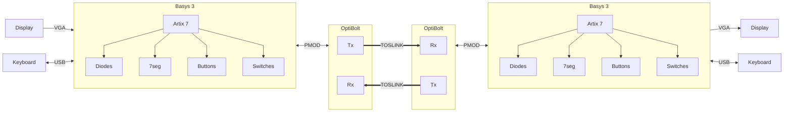

# OptiBolt - Protocol and Testbench

**Autorzy:** *Tomasz Więcławski (@TomaszWieclawski), Sebastian Zoń (@Ziemniaczenka)*

## Opis projektu

*Tu będzie opis*

## TODO

<b><big> Lista Zadań </big></b>

*   

    
<b>Dokumentacja i konfiguracja </b>

    - [x] Ustalić nazwę projektu
    - [ ] Krótki opis
    - [ ] Git
      - [x] Stworzyć Repo
      - [ ] Dowiedzieć się jak działają pull request i review
    - [x] Napisać README
    - [x] Dodać referencyjne dokumenty (np. zielony pdf z konwencjami)
    - [ ] VSCode settings + formatter config
    - [ ] Nauczyć się Markdown i Mermaid

    

*   

    
<b>Hardware</b>

    - [x] Znaleźć złącze
    - [ ] Narysować schemat
    - [ ] Zamówić brakujące części
    - [ ] Zlutować
    

*   

    
<b>Protokół</b>

    - [ ] Założenia, teoria
    - [ ] Warstwy modelu
    - [ ] Flowchart, Sequence diagrams
    

*   

    
<b>Program testowy</b>

    - [ ] Wyświetlanie VGA
      - [ ] Rysowanie znaków
      - [ ] DrawString
      - [ ] FontLibrary
      - [ ] DrawChart
    - [ ] Obsługa klawiatury
    - [ ] Różne testy (max baudrate, BER, latency, wysyłanie wiadomości, itd)
    

*   

    
<b>Systemverilog</b>

    - [ ] Podział na moduły, diagram
    - [ ] Testbenche do każdej grupy modułów/do każdego modułu?
    

## Narzędzia i materiały dodatkowe

<b><big> Lista Narzędzi </big></b>

*   

    
<big>VSCode </big>

    
    * **Rozszerzenia**
      * SystemVerilog
        * Verilog-HDL/SystemVerilog/Bluespec SystemVerilog by Masahiro Hiramori
          * Verible
        * DVT IDE for Verilog/SystemVerilog/VHDL/e Language by AMIQ EDA s.r.l.
          * Dostępne tylko w pracowni!
      * Dokumentacja
        * Markdown
          * Markdown All in One
          * Markdown Preview Mermaid Support
        * vscode-pdf
        * TIFF Preview
        * Docx/ODT Viewer
        
      * Git
        * GitHub Pull Requests

    

*   

    
<big>Materiały dodatkowe </big>

    
    * **Zasady kodowania**
      * [wikiMTM](https://wiki.mtm.agh.edu.pl/pl/students/courses/uec/sv-rtl-coding-rules)
      * [PDF](doc/mtm-digital-guidelines.pdf)
    * **Informacje na temat protokołu**
      * [Hardware 1](https://vksdr.com/pmod/)   
      * [Hardware 2](https://tomverbeure.github.io/2021/01/18/SPDIF-Output-PMOD.html)   
      * [Toslink info](https://w2.electrodragon.com/Network-dat/fiber-optic-dat/TOSLINK-dat/TOSLINK-dat.md)
    * **Git**
      * [Poradnik gita](https://git-scm.com/book/pl/v2)
    * **Markdown**
      * GitHub Flavored Markdown
        * [Tutorial](https://docs.github.com/en/get-started/writing-on-github)
      * Mermaid
        * [Online editor](https://mermaid.ai/live/)
        * [Docs](https://mermaid.js.org/intro/)
    * **Grafiki**
      * [Lopaka - pixelart](https://lopaka.app/)

    

## Architektura Sprzętowa

<b><big>Schemat Blokowy Połączeń </big></b>

<b><big>Schemat Modułu OptiBolt PMOD </big></b>

<!-- Dwa pliki z odwróconym kolorem dla jasnego i ciemnego motywu -->

